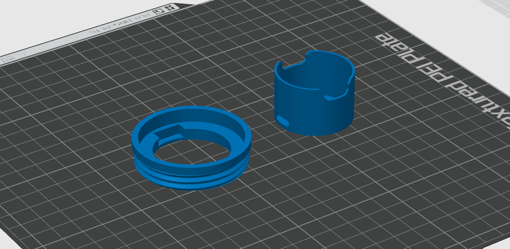
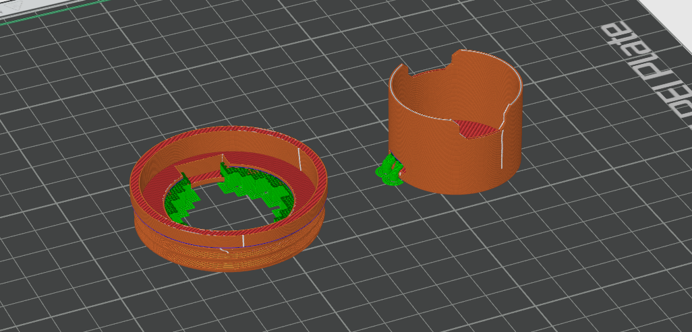
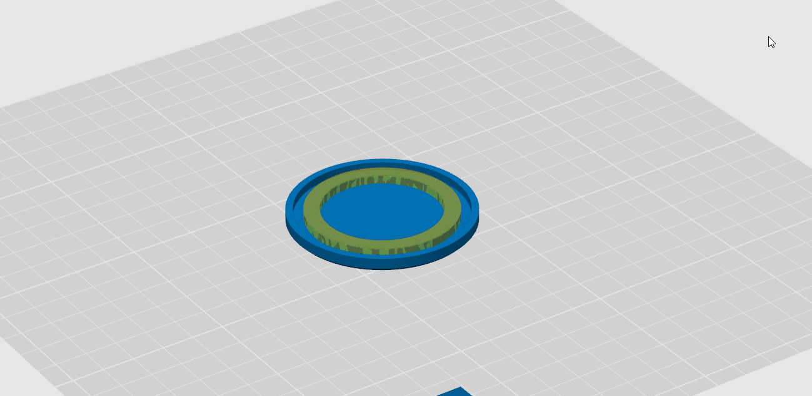
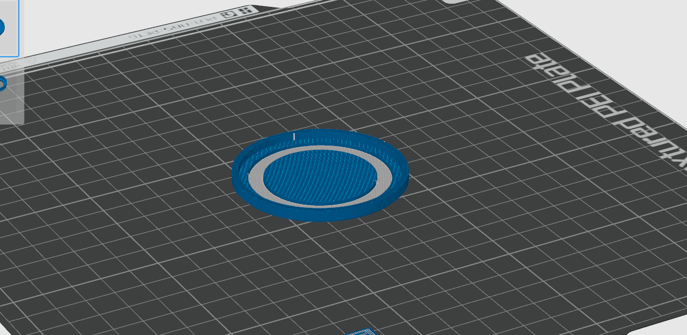
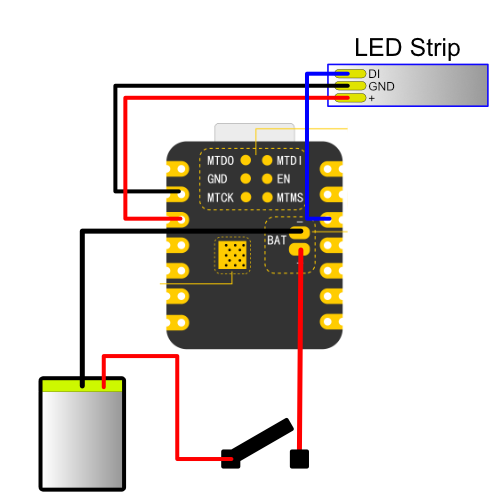
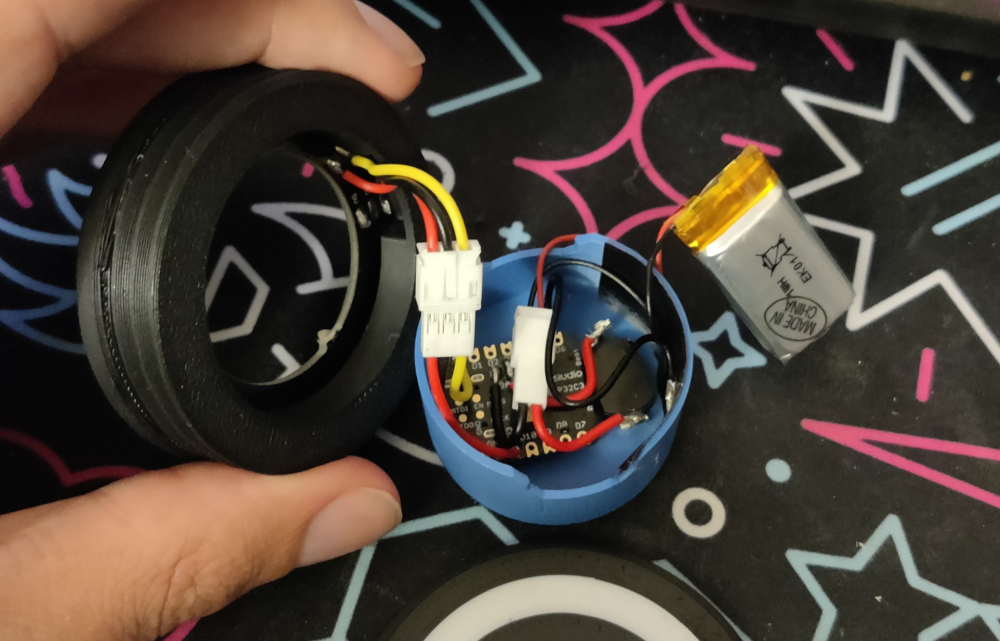
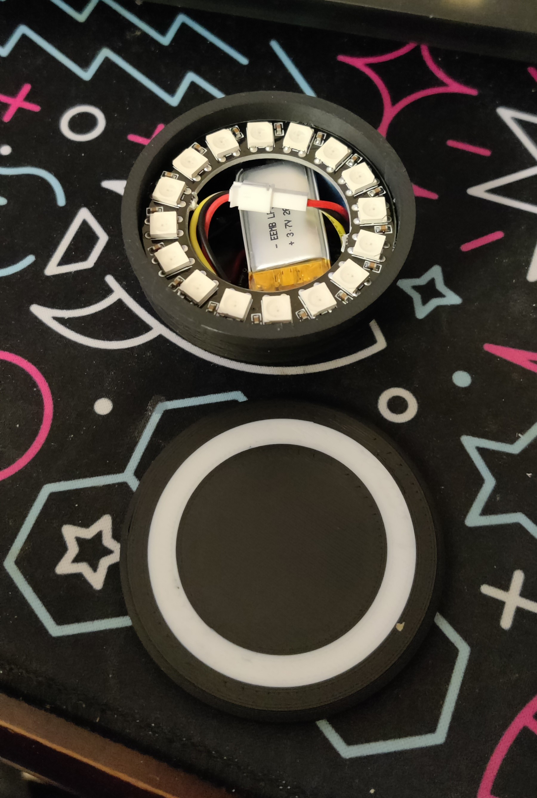

1. [Bill of Material](#bill-of-material)
2. [Print Instructions](#print-instructions)
3. [Assembly Instruction](#assembly-instructions)
4. [Putting the Nose Ring on](#putting-the-nose-ring-on)

# Bill of Material
(Note: All of the link are **NOT** affiliated, I do not make money if you use these. Feel free to source your components elsewhere 😉)

 

| Item                                                                                             | Amount           | Price         |
| ------------------------------------------------------------------------------------------------ | ---------------- | ------------- |
| [Seeed Studio XIAO ESP32C3](https://vi.aliexpress.com/item/1005005382287176.html)                | 1                | GBP 3.80      |
| [White PLA](https://www.amazon.co.uk/dp/B0BPC7RCPT)                                              | 1g               | GBP 0.02      |
| [Black PLA](https://www.amazon.co.uk/dp/B08JG35BNP)                                              | 20g              | GBP 0.40      |
| [Latching Push Button](https://www.amazon.co.uk/dp/B07BMNYJ13)                                   | 1                | GBP 0.20      |
| [JST 3 pin cable](https://vi.aliexpress.com/item/4000450837340.html)                             | 1 pair           | GBP 0.12      |
| [JST 2 pin cable](https://www.amazon.co.uk/gp/product/B08JVC4LVG)                                | 1 pair           | GBP 0.60      |
| [3.7V Li-ion 502030 Battery 250mAh](https://www.amazon.co.uk/dp/B08FD3V6TF)                      | 1                | GBP 7.00      |
| [16 LED Ring PCB](https://vi.aliexpress.com/item/1005002286128420.html)                          | 1                | GBP 2.00      |
| **TOTAL**                                                                                        | -                | **GBP 14.15** |

***Note:** All prices are without shipping cost, and the total doesn't reflect the electricity or labour expenses*

# Print Instructions
This print **requires** a multi filament system as the moment. The 3MF can be opened in Bambu or Orca Slicer and is setup ready to print.

(I'll be working on an non AMS version whenever I can)

## Ring and Electronic Box

Print the **MSAInsert** and **ElectronicsHolder**

The MSAInsert requires a bit of support for the ridge in the center to block the electronics box when put in place.
Default print setting are usually fine, 20% infill is good enoug

 
 

 
 

## Cap

Use the Cap file as a base, and use the CapLightInsert to serve as a negative part and another instance of it as a modifier to make it is transparent or white filament.

For the negative part, offset it by 0.8mm up to keep a nice solid layer, but not too thick it would block light.

 
 

 
 

# Assembly Instructions
## Wiring

 

## WLED Setup
You can use anything you want for the control of your nose ring, even do custom code, but for the sake of simplicity, you can also just use WLED

[You can find installation instructions here](https://kno.wled.ge/basics/install-binary/)

Once installed, make sure you set the LED Strip length correctly (16 Leds if using my BOM), and the Data Pin (D2 is GPIO 4, so put 4 in there)

## Battery life

Based on my tests, and for best longevity, you should set the maximum brightness of the LEDs to around 30%. 

More will be brighter, but probably not worth it, and at 30% the whole contraption uses around 30mAh, meaning on the battery suggested, you would get around 2 hours of battery life.

## Shoving it all in the box

 
 

1. Stick the wifi antenna to the side of the electronic holder
2. Place a small piece of double-sided tape on the shield of the microcontroller and place it upside down with the USB Port through the dedicated hole
4. Glue the push button in the dedicated hole
3. Plug the battery on the JST connector and put it where there is still some space left. Depending of the wire you are using, it might end up being a tight fit

 
 

5. Using double sided tape, place the LED ring into the holder
6. Plug it ton the electronics
7. Close the whole thing up and voila ✨