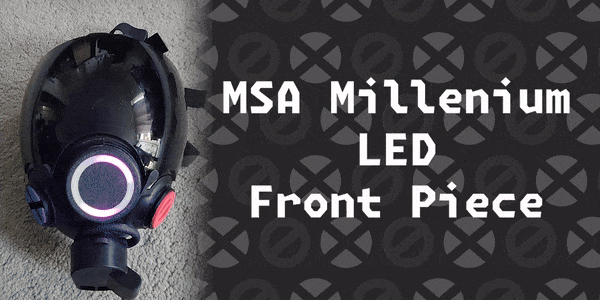

 
 

# 🌈 MSA LED Front Piece
A collection of 3D printed files and instruction to build a WLED powered Front Piece replacement for MSA masks.

# 🤔 Too lazy to build yourself?
**I can probably help you out!**

I'll probably open my services every now and then, but do check my Ko-Fi page for more info on price, availability and contact info.

 

# 🛠 How to build?
Please check the [How-To guide](HOWTO.md) on build instructions and bill of materials

# ✨ Thanks
This project is based on the work (and might even be compatible with) a different contraption from [Robin](https://rubber.social/@Robin@xantronix.social) used for HexCorp modules, so big thanks to them for letting me use their files as reference ✨

# ⚖ License
 
<a property="dct:title" rel="cc:attributionURL" href="https://github.com/Xantw0/MSA-LED-Front-Piece">MSA LED Front Piece</a> by <a rel="cc:attributionURL dct:creator" property="cc:attributionName" href="https://xantw0.net">Xantw0</a> is licensed under <a href="http://creativecommons.org/licenses/by-nc-sa/4.0/?ref=chooser-v1" target="_blank" rel="license noopener noreferrer" style="display:inline-block;">Attribution-NonCommercial-ShareAlike 4.0 International</a>
 